# RISC-V_MYTH_Workshop

For students of "Microprocessor for You in Thirty Hours" Workshop, offered by for VLSI System Design (VSD) and Redwood EDA, find here accompanying live info and links.

Refer to README at [stevehoover/RISC-V_MYTH_Workshop](https://github.com/stevehoover/RISC-V_MYTH_Workshop) for lab instructions.

Add your codes in the [calculator_solutions.tlv](calculator_solutions.tlv) and [risc-v_solutions.tlv](risc-v_solutions.tlv) files and **keep committing** to your repository after every lab.

# Day 3 Basic Calculator implementation

<h2> Introduction </h2>

 The project focusses on implementing a basic calculator with functions of add,subtract,multiply,divide,store and recall. The project is implemented using TL Verilog which encapsulates over the conventional verilog providing simplicity to the programmer. The project is divided into 6 six steps starting from implementing logic till pipelining to make it faster.

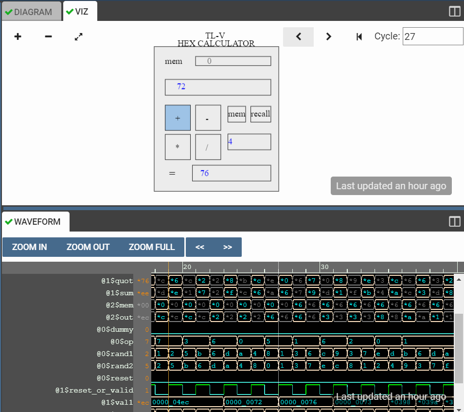

<h2> Implementing Combinational Logic </h2>

 The calculator performs functions with 32 bits. The input to the calculator are provided in random between 0 to 15 to avoid any overflow or underflow. The particular operation is selected using op variable which is of 2 bits to select between 4 possible combinations of add,subtract,multiply and divide.

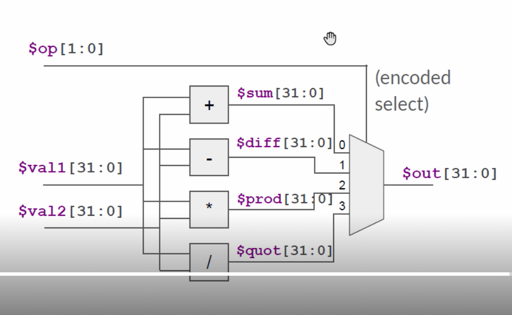

<h2> Implementing Sequential Logic </h2>

 Here we add a register to output to store the value of the operation. Also the value is passed back to the one of input values useful to perform increment operations.

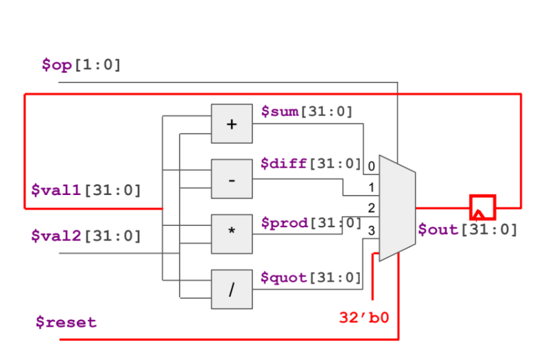

<h2> Implementing Counter </h2>

 We add a basic 1 bit counter for making the output enabling in alternating time steps which will be useful for pipelining. Also wee added the functionality in the first stage of pipeline and in the zeroth stage we have global reset which can propagate till the end. 

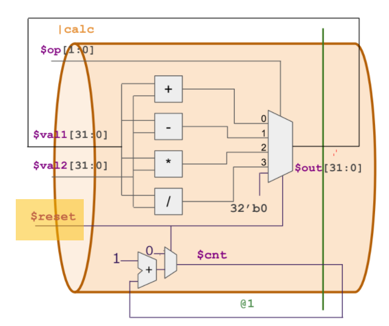

<h2> Pipelining </h2>

 We add a 2 stage pipeline to seprate the operations and output selection for faster performance. We then make output valid for once in 2 cycles for enabling the propagation of values from previous stage.

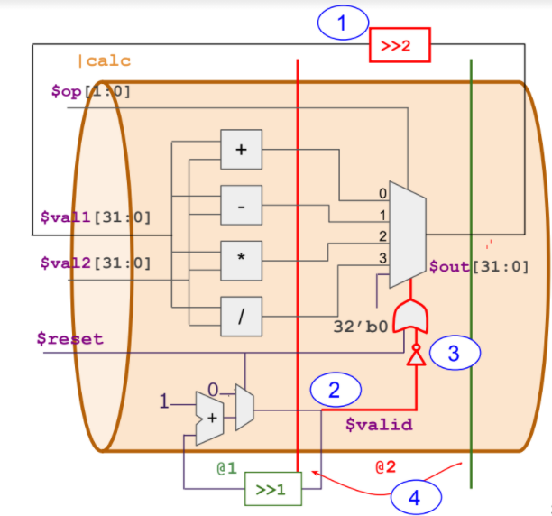

<h2> Complete assembly with memory </h2>

 Finally we add memory to our circuit to store and recall the value. We also add additional 2 stages to make the design consistent throughtout the project for the memory.

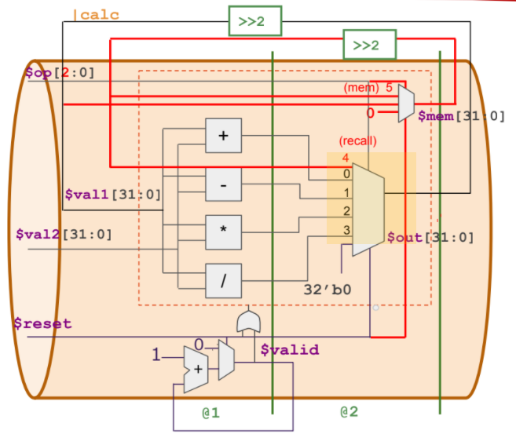

<h2> Output </h2>

<h4> Complete Circuit </h4>

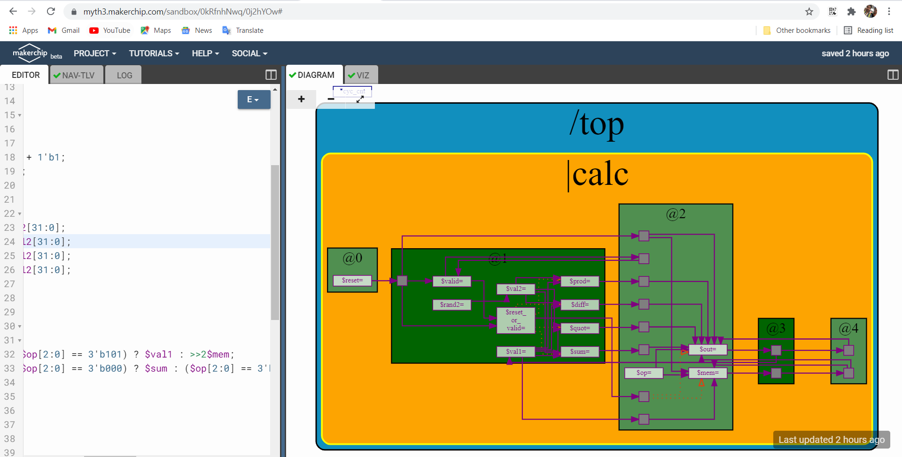

<h4> Addition </h4>

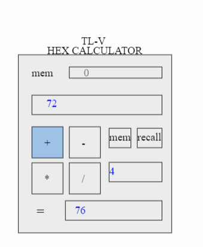

<h4> Memory </h4>

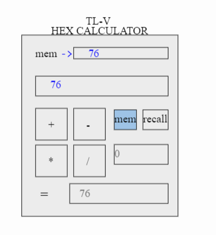

<h4> Division </h4>

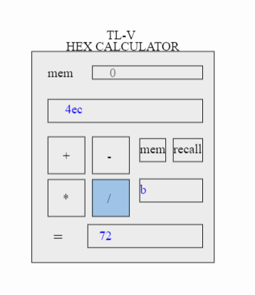

<h4> Product </h4>

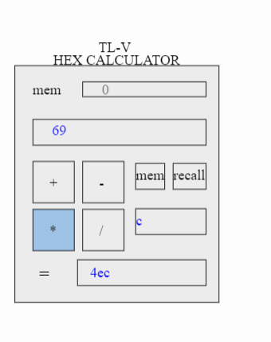

